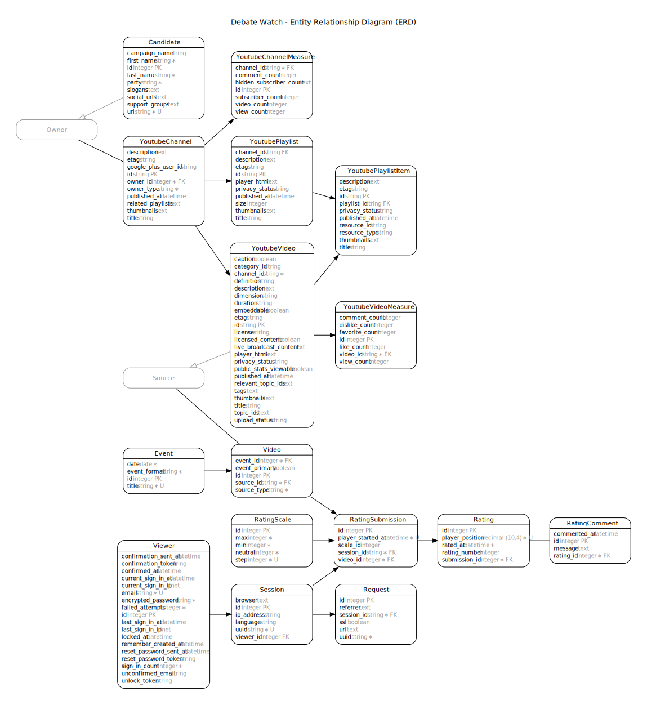

# 2016 Campaign Data

This repository contains relational data describing
 the 2016 US Presidential Election.

It currently includes information about candidates and their YouTube videos.

This data is a product of the [debate watch](https://github.com//debate-watch/debate-watch/) information system.

## Usage

Download the repository.

```` sh
git clone git@github.com:gwu-business/2016-election-data.git
````

Import the .csv files into a DBMS, or parse with a scripting language.

## Reference

### Schema Diagram


